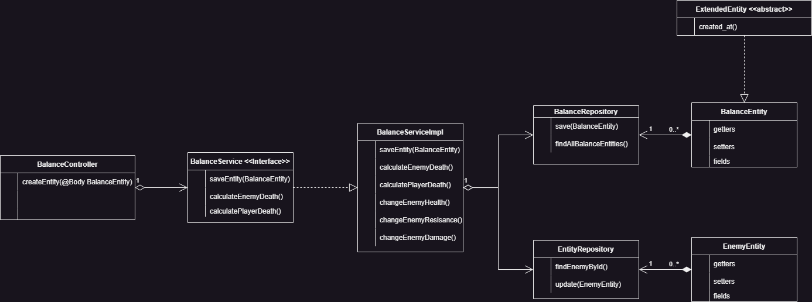
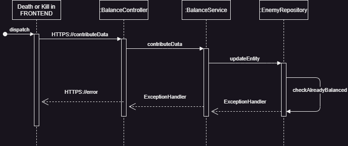

# Dungeoncrawler Generation-based ML

## Inhaltsverzeichniss
- [Dungeoncrawler Generation-based ML](#dungeoncrawler-generation-based-ml)
  - [Inhaltsverzeichniss](#inhaltsverzeichniss)
    - [ Glossar](#-glossar)
    - [ Beschreibung](#-beschreibung)
    - [ Vorbereitung](#-vorbereitung)
    - [ Implementation](#-implementation)
    - [ Notizen](#-notizen)
    - [ Diagramme](#-diagramme)
      - [Klassendiagramm](#klassendiagramm)
      - [Sequenzdiagramm](#sequenzdiagramm)

###  Glossar

|Wort|Beschreibung   |
|---|---|
|Balancing|Eigenschafte eines Gegenstandes oder eines Gegners werden angepasst. Z.B. wird die maximale Gesundheit oder der Schaden welcher angerichtet wird, angepasst|
|Nerf|Ein Nerf bei einem Gegenstand oder eine, Gegner führt dazu, dass dieser schlechter wird. Z.B wird beim gegner das maximale Leben verringert, oder dass ein Gegenstand weniger nützlich wird|
|Buff|Bei einem Buff passiert das gegenteil von einem Nerf. Der Gegner oder Gegenstand wird besser. Z.B. wird bei einem Gegenstand die Haltbarkeit, Schaden oder Resistenz erhöht.|
###  Beschreibung

Als abschlussprojekt im Basislehrjahr der Noser Young haben wir als Gruppe einen Dungeoncrawler gemacht. Dabei wurde Anfangs reines TypeScript und React benutzt. Über mehrer Entwicklungsstadien und Module entwickelte sich das Spiel immer weiter fort. Im Aktuellen Modul 320 setzten wir (Mikka Kummer, Cedric Zollinger) uns das Ziel, dem ganzen Spiel ein Balancing zu geben. Anfangs wurde lediglich Gegner und Gegegstände nach besten Gefühl eingefügt, mit stark variierenden Statistiken. In unserem Projekt soll dies nun geändert werden. Dazu entschieden wir uns, ein neues Thema anzuschauen, nämlich AI / ML. Nach einlesen in das Thema, fiel der entschied, das wir unser balancing mithilfe einer Generation-base ML Technik machen. Was wir damit erreichen wollen ist, das nach dem Tot oder einem Kill eines Spielers, die Daten des Kampfes analysiert werden. Aus den gesammelten Daten wird dann über einen Algorithmus entschieden, ober der Gegner einen Nerf oder Buff erhält

###  Vorbereitung
Um mit unserem Projekt und der Implementation der Logik beginnen zu können, mussten zuerst einige Vorbereitungen getroffen werden. Ein wichtiger Punkt für das ganze Balancing ist, das genügend Daten vorhanden sind. Das heisst nicht nur die Anzahl, sondern auch welche. Denn nur mit genügend Daten, können wir ein genaueres Ergebniss des Balancings erzielen. Um dies zu erreichen schrieben wir das Backend, welches die Daten von jedem Kampf im Spiel erhält. Dabei konnten wir nach jedem Kampf herauslesen, ob der Spieler überlebt hat, wie viel Leben der Spieler noch hatte, ob der Gegner noch Lebt und mit wie viel Leben. Wie viel Schaden und Restistenz der Spieler hatte. Auch wurde das Inventar des Spielers gespeichert. Wichtig war zudem noch, welcher Gegner das war, ob es ein Boss gegner ist und bei welcher Stage der Spieler war. 
Es mussten auch einige Formeln erstellt werden, da die Statistiken des Spielers stark von den Gegenständen im Spiel beiinflusst wurden. Unser Ziel war dabei, die Grundwerte des Spielers, des Gegners und deren Bonus Werte in betracht zu ziehen. 

###  Implementation

###  Notizen

.png)
.png)
.png)
.png)

###  Diagramme
#### Klassendiagramm

***
#### Sequenzdiagramm

